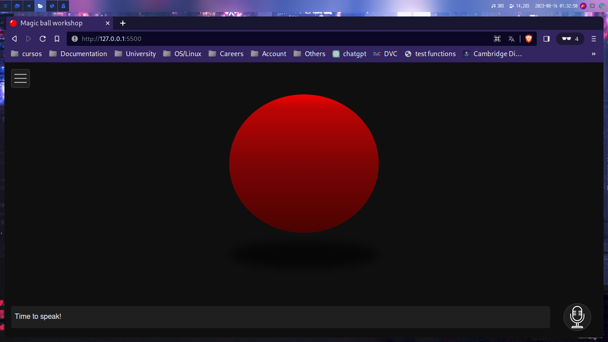
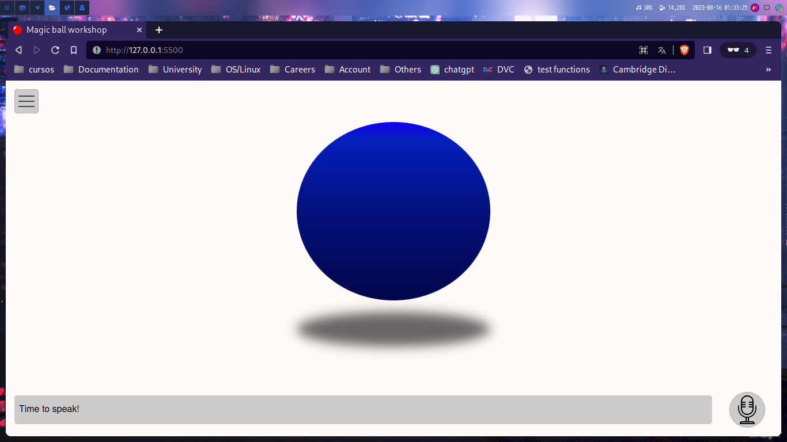

# Magic ball workshop

This is a workshop mainly for frontend developer who wants to learn
a bit more about frontend, the aim of this workshop is to perform
some JS functionalities every frontend developer should know, some
advance features to craft a small project on steroids

## What are you learning?

- Efficient native dark and white modes (How to)

- Some infrastructure styles

- Web Speech API

- Accessibility features I use for AI

## Special thanks to

- [Open Smart Festival](https://www.ambiot.com.co/eventos/) for the invitations

- [FOREST Software Community](https://github.com/F-O-R-E-S-T) for providing support

- [icon8](https://icons8.com/) for providing icons
